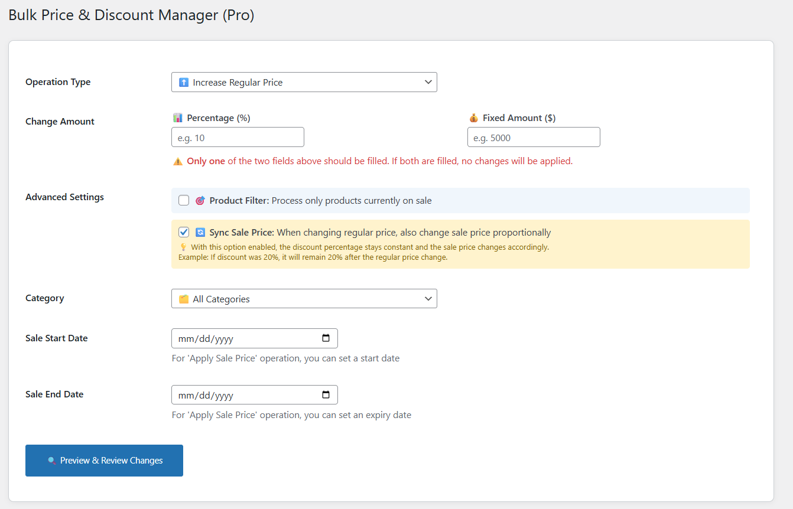
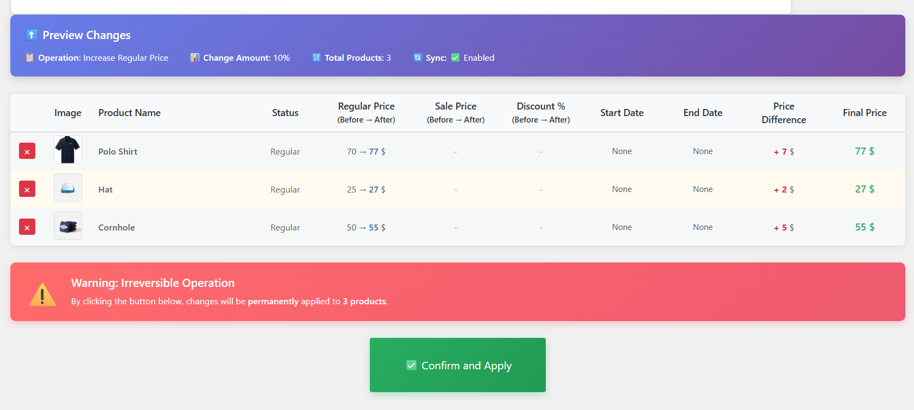

# 🏷️ WooCommerce Bulk Price & Discount Editor Pro

> **The most powerful and user-friendly WooCommerce price management solution**

A professional WordPress plugin for managing WooCommerce product prices and discounts in bulk. Built with modern architecture, full translation support, and an intuitive interface that makes complex pricing operations simple.

[](https://wordpress.org/)
[](https://woocommerce.com/)
[](https://php.net/)
[](LICENSE)
[](https://woocommerce.com/document/high-performance-order-storage/)

---

## ✨ Features

### 🎯 Core Functionality
- **Bulk Price Operations**: Increase, decrease, or set sale prices for hundreds of products at once
- **Multiple Calculation Methods**: Choose between percentage-based or fixed amount changes
- **Live Preview**: See all changes before applying them - no surprises!
- **Smart Filtering**: Target products by category or sale status
- **Selective Application**: Remove specific products from the preview before applying changes
- **Sale Price Sync**: Automatically maintain discount percentages when changing regular prices

### 💰 Price Operations
- ⬆️ **Increase Regular Price**: Boost product prices by percentage or fixed amount
- ⬇️ **Decrease Regular Price**: Reduce prices across multiple products
- 🏷️ **Apply/Update Sale Price**: Set discounts with optional start and end dates
- ❌ **Remove All Discounts**: Clear sale prices from products in bulk
- 🔄 **Synchronization**: Keep discount percentages constant when regular prices change

### 🎨 User Experience
- **Intuitive Interface**: Clean, modern design with visual feedback
- **Real-time Validation**: Instant feedback on input errors
- **Product Images**: Visual confirmation with product thumbnails
- **Detailed Preview**: See before/after prices, discount percentages, and price differences
- **Progress Tracking**: Live status updates during batch operations
- **Responsive Design**: Works perfectly on all devices

### 🌍 Internationalization
- **Full Translation Support**: Built with WordPress i18n best practices
- **English & Persian**: Complete translations included
- **RTL Ready**: Perfect support for right-to-left languages
- **Extensible**: Easy to add new language translations

### ⚙️ Technical Excellence
- **HPOS Compatible**: Full support for WooCommerce High-Performance Order Storage
- **Modular Architecture**: Clean, maintainable code following SOLID principles
- **Batch Processing**: Handle thousands of products without timeouts
- **Precision Handling**: No floating-point errors with Iranian Rial or similar currencies
- **AJAX-Powered**: Smooth, async operations without page reloads
- **Secure**: Nonce verification, capability checks, and input sanitization

---

## 📸 Screenshots

### Main Interface

*Clean, intuitive form with all options at your fingertips*

### Live Preview

*See exactly what will change before you commit*

---

## 🚀 Installation

### Requirements
- **WordPress**: 5.0 or higher
- **WooCommerce**: 9.5 or higher (HPOS compatible)
- **PHP**: 7.4 or higher
- **MySQL**: 5.6 or higher

### Quick Install

1. **Download the Plugin**
   ```bash
   git clone https://github.com/yourusername/woocommerce-bulk-price-editor.git
   ```

2. **Upload to WordPress**
   - Upload the plugin folder to `/wp-content/plugins/`
   - Or upload via WordPress admin: `Plugins > Add New > Upload Plugin`

3. **Activate**
   - Go to `Plugins > Installed Plugins`
   - Find "WooCommerce Bulk Price & Discount Editor Pro"
   - Click "Activate"

4. **Access the Plugin**
   - Navigate to `Bulk Price Editor` in the WordPress admin menu
   - Start managing your prices!

---

## 📖 Usage Guide

### Basic Workflow

#### 1. Choose Your Operation
Select from four powerful operation types:
- **⬆️ Increase Regular Price**: Add to existing prices
- **⬇️ Decrease Regular Price**: Reduce existing prices
- **🏷️ Apply/Update Sale Price**: Set discount prices
- **❌ Remove All Discounts**: Clear all sale prices

#### 2. Set Change Amount
Choose **ONE** of these methods:
- **📊 Percentage (%)**: Change prices by a percentage (e.g., 10% increase)
- **💰 Fixed Amount**: Change prices by a fixed value (e.g., 5000 Rial)

> ⚠️ **Important**: Only fill ONE field. If both are filled, no changes will be applied.

#### 3. Configure Advanced Options

**🎯 Product Filter**
- ✅ Enable to process only products currently on sale
- ⬜ Disable to process all products (default)

**🔄 Sync Sale Price**
- ✅ Enable to maintain discount percentages (default)
- ⬜ Disable to keep sale prices unchanged when regular prices change

**Example**: If a product has 20% discount and you increase regular price by 10%:
- **Sync ON**: Sale price also increases to maintain 20% discount
- **Sync OFF**: Sale price stays the same (discount % changes)

#### 4. Apply Filters (Optional)
- **🗂️ Category**: Select a specific category or "All Categories"
- **📅 Sale Start Date**: Set when the sale should begin (for sale price operations)
- **📅 Sale End Date**: Set when the sale should end (for sale price operations)

#### 5. Preview & Review Changes
1. Click **🔍 Preview & Review Changes**
2. Review the preview table showing:
   - Product images and names
   - Current status (On Sale / Regular)
   - Before → After prices
   - Discount percentages
   - Sale dates
   - Price differences
   - Final prices

3. **Remove unwanted products**: Click the ❌ button next to any product you want to exclude

#### 6. Apply Changes
1. Click **✅ Confirm and Apply**
2. Confirm the action in the popup dialog
3. Wait for batch processing to complete
4. Refresh the page to see updated products

---

## 🏗️ Technical Architecture

### File Structure
```
bulk-price-discount-editor/
├── admin/
│   ├── class-admin-assets.php      # Asset management
│   ├── class-admin-menu.php        # Menu registration
│   └── views/
│       ├── admin-page.php          # Main admin page
│       ├── components/             # Reusable UI components
│       │   ├── operation-header.php
│       │   └── notice-box.php
│       └── partials/               # Template partials
│           ├── form-fields.php
│           ├── preview-table.php
│           └── pagination.php
├── assets/
│   ├── css/
│   │   └── bulk-pricer-admin.css   # Admin styles
│   └── js/
│       └── bulk-pricer-admin.js    # AJAX & UI interactions
├── includes/
│   ├── controllers/                # Request handlers
│   │   ├── class-ajax-controller.php
│   │   └── class-preview-controller.php
│   ├── models/                     # Business logic
│   │   ├── class-pricing-calculator.php
│   │   ├── class-product-model.php
│   │   ├── calculators/
│   │   │   └── class-price-calculator.php
│   │   ├── formatters/
│   │   │   └── class-product-data-formatter.php
│   │   └── handlers/
│   │       └── class-date-handler.php
│   └── utilities/                  # Helper classes
│       └── class-formatter.php
├── languages/                      # Translation files
│   ├── bulk-price-discount-editor.pot
│   ├── bulk-price-discount-editor-en_US.po
│   ├── bulk-price-discount-editor-en_US.mo
│   ├── bulk-price-discount-editor-fa_IR.po
│   ├── bulk-price-discount-editor-fa_IR.mo
│   └── compile-mo.php             # MO compiler script
├── index.php                       # Plugin bootstrap
└── README.md                       # This file
```

### Design Patterns

#### MVC Architecture
- **Models**: Business logic and data manipulation
- **Views**: Template files for UI rendering
- **Controllers**: Request handling and orchestration

#### Single Responsibility Principle
Each class has one clear purpose:
- `Bulk_Pricer_Price_Calculator`: Mathematical price calculations
- `Bulk_Pricer_Product_Data_Formatter`: Data formatting and presentation
- `Bulk_Pricer_Date_Handler`: Date operations and formatting
- `Bulk_Pricer_Formatter`: General formatting utilities

#### Dependency Injection
Clean, testable code with explicit dependencies:
```php
public function __construct() {
    $this->price_calc = new Bulk_Pricer_Price_Calculator();
    $this->date_handler = new Bulk_Pricer_Date_Handler();
    $this->formatter = new Bulk_Pricer_Product_Data_Formatter();
}
```

### Key Technical Features

#### Precision Handling
Eliminates floating-point errors common with large numbers:
```php
// Before: 21,676,000 - 1,000,000 = 20,676,001 ❌
// After: Perfect calculation = 20,676,000 ✅
$new_price = (int) round($price, 0, PHP_ROUND_HALF_DOWN);
```

#### Batch Processing
Handles unlimited products without PHP timeout:
- Processes 20 products per batch
- AJAX-based pagination
- Progress tracking with visual feedback

#### Security
- Nonce verification on all AJAX requests
- Capability checks (`manage_options`)
- Input sanitization and validation
- Prevents direct file access

#### Translation System
WordPress-native i18n implementation:
```php
// PHP templates
echo esc_html__('Product Name', 'bulk-price-discount-editor');

// JavaScript localization
wp_localize_script('bulk-pricer-admin-js', 'sbp_vars', array(
    'i18n' => array(
        'loading_preview' => __('Loading preview page', 'bulk-price-discount-editor')
    )
));
```

---

## 🌍 Translation

### Included Languages
- 🇬🇧 **English** (en_US) - Default
- 🇮🇷 **Persian/Farsi** (fa_IR) - Complete translation

### Adding New Languages

1. **Generate POT Template**
   ```bash
   wp i18n make-pot . languages/bulk-price-discount-editor.pot
   ```

2. **Create Language Files**
   - Copy `bulk-price-discount-editor.pot` to `bulk-price-discount-editor-{locale}.po`
   - Translate all strings
   - Example: `bulk-price-discount-editor-fr_FR.po` for French

3. **Compile MO Files**
   ```bash
   cd languages/
   php compile-mo.php
   ```

4. **Activate in WordPress**
   - Go to `Settings > General`
   - Select your language
   - Deactivate and reactivate the plugin

### Translation Files
- **POT**: Template file with all translatable strings
- **PO**: Human-readable translation source files
- **MO**: Compiled binary files used by WordPress

---

## 🔧 Configuration

### WooCommerce Settings
The plugin automatically detects:
- Currency symbol from WooCommerce settings
- Product categories
- HPOS (High-Performance Order Storage) status

### Advanced Configuration
For developers, you can hook into plugin operations:

```php
// Before price changes are applied
add_action('sbp_before_price_update', function($product_id, $old_price, $new_price) {
    // Your custom logic
}, 10, 3);

// After price changes are applied
add_action('sbp_after_price_update', function($product_id, $new_price) {
    // Your custom logic
}, 10, 2);
```

---

## 🐛 Troubleshooting

### Common Issues

#### "WooCommerce is Required" Notice
**Solution**: Install and activate WooCommerce before activating this plugin.

#### Translations Not Working
**Solution**:
1. Go to `Settings > General`
2. Set correct language (e.g., فارسی for Persian)
3. Deactivate and reactivate the plugin
4. Clear browser cache

#### Price Changes Not Applying
**Checks**:
- Only ONE of "Percentage" or "Fixed Amount" should be filled
- Value must be greater than 0
- Products must exist in selected category/filters

#### Timeout Errors
**Solution**: The plugin uses batch processing to prevent timeouts. If you still experience issues:
- Increase PHP `max_execution_time` in php.ini
- Contact your hosting provider

---

## 📊 Performance

### Benchmarks
- **Small Store** (100-500 products): < 2 seconds
- **Medium Store** (500-2,000 products): 5-15 seconds
- **Large Store** (2,000-10,000 products): 20-60 seconds
- **Enterprise** (10,000+ products): Scales linearly with batch processing

### Optimization Tips
- Use category filters to target specific products
- Process during off-peak hours for large operations
- Enable object caching (Redis/Memcached) for better performance

---

## 🤝 Contributing

Contributions are welcome! Here's how you can help:

### Reporting Bugs
1. Check existing issues first
2. Create a detailed bug report with:
   - WordPress version
   - WooCommerce version
   - PHP version
   - Steps to reproduce
   - Expected vs actual behavior
   - Screenshots if applicable

### Suggesting Features
1. Open an issue with the `enhancement` label
2. Describe the feature and use case
3. Explain why it would be valuable

### Code Contributions
1. Fork the repository
2. Create a feature branch (`git checkout -b feature/amazing-feature`)
3. Follow WordPress coding standards
4. Write clear commit messages
5. Test thoroughly
6. Submit a pull request

### Translation Contributions
1. Create a new language PO file
2. Translate all strings
3. Test in WordPress
4. Submit via pull request

---

## 📜 Changelog

### Version 2.0.0 (2025-01-01)
#### 🎉 Major Release - Complete Rewrite

**Added**
- ✨ Live preview before applying changes
- 🖼️ Product images in preview table
- 📅 Sale start and end date support
- ❌ Ability to remove products from preview
- 🔄 Sale price synchronization option
- 🌍 Full translation support (English & Persian)
- 🎯 Filter by product sale status
- 📊 Detailed price change information
- ⚡ Batch processing for large stores
- 🎨 Modern, intuitive UI

**Changed**
- 🏗️ Complete architectural refactor (MVC pattern)
- 🔧 Separated concerns into specialized classes
- 💾 Improved database queries
- 🚀 Enhanced performance for large catalogs
- 📱 Responsive design improvements

**Fixed**
- 🐛 Floating-point precision errors with large numbers
- 🔌 WooCommerce loading order issues
- 🌐 Translation system fully functional
- 🔒 Enhanced security with nonce verification
- ⚡ PHP timeout issues with bulk operations

**Technical**
- ✅ HPOS (High-Performance Order Storage) compatibility
- ✅ WordPress 6.4+ tested
- ✅ WooCommerce 9.5+ tested
- ✅ PHP 8.2 compatible
- ✅ Follows WordPress coding standards

### Version 1.0.0
- Initial release
- Basic bulk price editing functionality

---

## 📄 License

This project is licensed under the **GNU General Public License v2.0**
**What this means:**
- ✅ You can use this plugin commercially
- ✅ You can modify the plugin
- ✅ You can distribute the plugin
- ✅ You must disclose source code changes
- ✅ You must use the same license for derivatives

---

## 👨‍💻 Author

**Your Name**
- GitHub: [@alirzaghlmpr](https://github.com/alirzaghlmpr)
- Website: [webioo.ir](https://webioo.ir)
- Email: alirzaghlmpr@gmail.com

---

## 🙏 Acknowledgments

- Thanks to the WordPress community for excellent documentation
- WooCommerce team for their extensible architecture
- All contributors who help improve this plugin
- Users who provide valuable feedback

---

## 💬 Support

### Documentation
- [Installation Guide](#-installation)
- [Usage Guide](#-usage-guide)
- [Troubleshooting](#-troubleshooting)

### Professional Support
Need custom development or priority support?
- Contact: alirzaghlmpr@gmail.com
- Response time: Within 24 hours

---

## ⭐ Show Your Support

If this plugin helped you, please:
- ⭐ Star this repository
- 🐦 Share on social media
- 📝 Write a review
- 🤝 Contribute to the project

---

<div align="center">

**Made with ❤️ for the WordPress & WooCommerce community**

[⬆ Back to Top](#️-woocommerce-bulk-price--discount-editor-pro)

</div>
